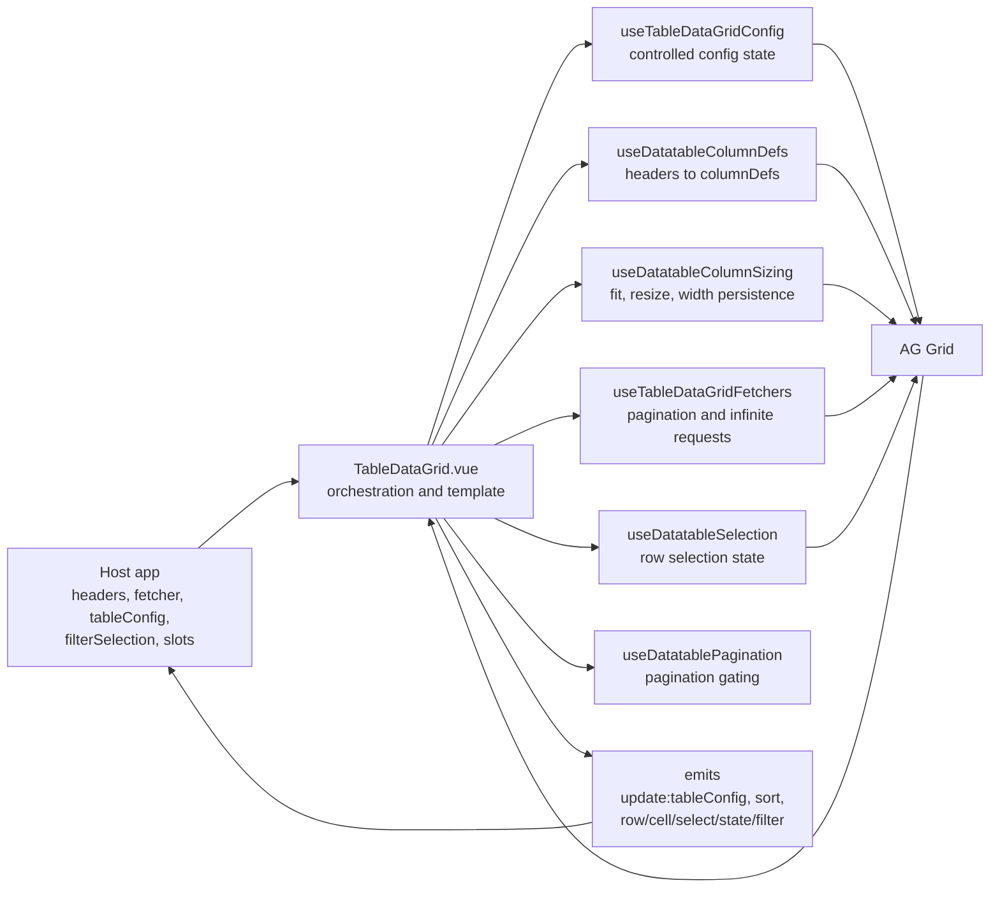
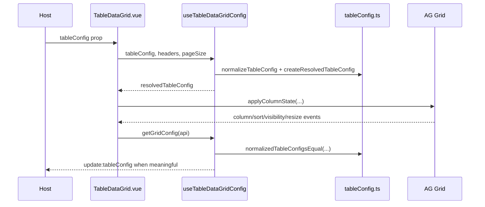
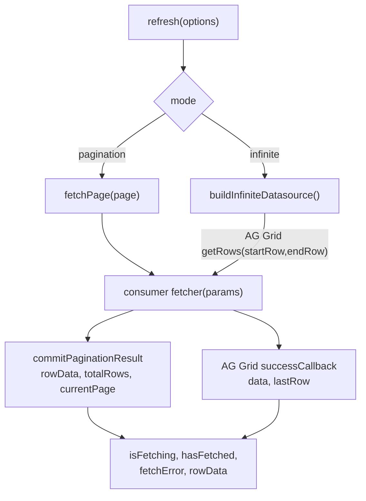
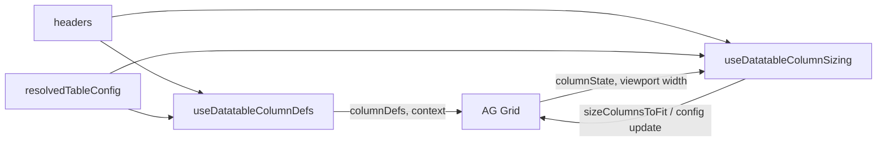
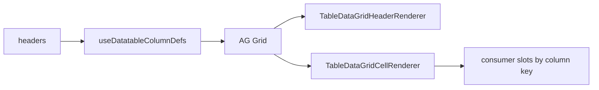

# Table Data Grid Architecture

`@kong-ui-public/table-data-grid` is a Vue wrapper around AG Grid for table data grids. Consumers provide typed headers, a fetcher, optional controlled table configuration, filter state, and slots. The package translates that public contract into AG Grid state, fetches rows, renders table chrome, and emits user-driven changes back to the host.

The core principle is:

> AG Grid owns the immediate grid mechanics; `tableConfig` and the fetcher contract are the public integration boundaries.

## Top-level dataflow

## Main modules

| Area | File | Owns |
| --- | --- | --- |
| Wrapper orchestration | [`src/components/TableDataGrid.vue`](../src/components/TableDataGrid.vue) | Template, AG Grid wiring, toolbar state, event handlers, and composable coordination |
| Public contract | [`src/types/index.ts`](../src/types/index.ts) | Header, config, fetcher, row key, selection, slot, and attribute types |
| Config state | [`src/composables/useTableDataGridConfig.ts`](../src/composables/useTableDataGridConfig.ts) | Internal active config, resolved config, applying config to AG Grid, emitting config updates |
| Config translation | [`src/utils/tableConfig.ts`](../src/utils/tableConfig.ts), [`src/utils/tablePreferencesInterop.ts`](../src/utils/tablePreferencesInterop.ts) | Defaults, normalization, semantic equality, AG Grid `ColumnState` conversion, table preference conversion |
| Fetch lifecycle | [`src/composables/useTableDataGridFetchers.ts`](../src/composables/useTableDataGridFetchers.ts) | Pagination requests, infinite datasource creation, cursor tracking, stale request guards |
| Grid state sync | [`src/composables/useDatatableGridSync.ts`](../src/composables/useDatatableGridSync.ts) | AG Grid event handlers, config-change side effects, sort/page-size refresh dispatch, sizing handler injection |
| Column definitions | [`src/composables/useDatatableColumnDefs.ts`](../src/composables/useDatatableColumnDefs.ts) | Header order, `ColDef` creation, renderer context |
| Column sizing | [`src/composables/useDatatableColumnSizing.ts`](../src/composables/useDatatableColumnSizing.ts) | Fit preflight, `sizeColumnsToFit`, resize tracking, auto-fit width tracking, layout-side-effect filtering |
| Selection | [`src/composables/useDatatableSelection.ts`](../src/composables/useDatatableSelection.ts) | AG Grid row selection options, selected row tracking, public selection methods |
| Pagination controls | [`src/composables/useDatatablePagination.ts`](../src/composables/useDatatablePagination.ts) | Page navigation rules for known and unknown totals |
| Cell renderer | [`src/components/TableDataGridCellRenderer.vue`](../src/components/TableDataGridCellRenderer.vue) | Column-key slots, cell attrs, selected slot state, AG Grid renderer refresh |
| Header renderer | [`src/components/TableDataGridHeaderRenderer.vue`](../src/components/TableDataGridHeaderRenderer.vue) | Sort button, sort icon state, tooltip rendering |
| Column visibility menu | [`src/components/TableDataGridColumnVisibilityMenu.vue`](../src/components/TableDataGridColumnVisibilityMenu.vue) | Hideable-column menu, search, toggle-all visibility updates |

## Public contracts

| Contract | Direction | Purpose |
| --- | --- | --- |
| `headers` | Host to table | Defines column identity, labels, sortability, visibility rules, sizing defaults, filters, pinning defaults, and AG Grid passthrough options |
| `fetcher` | Host to table | Loads rows for either pagination mode or infinite mode |
| `tableConfig` | Host to table | Optional controlled state for persisted table preferences |
| `update:tableConfig` | Table to host | Emits user or grid changes that should be persisted by the host |
| `v-model:filterSelection` | Two-way | Canonical active filter state passed to the fetcher |
| Slots by column key | Host to table | Custom cell rendering |
| Toolbar/filter/state slots | Host to table | Custom table chrome and empty/error states |
| Row/cell/select/filter/sort/state events | Table to host | Notifications for user interaction and table lifecycle |

`tableConfig` contains the state that can be persisted across sessions:

| Field | Meaning |
| --- | --- |
| `columnOrder` | Ordered header keys |
| `columnVisibility` | Header key to visible boolean |
| `columnWidths` | Header key to pixel width |
| `pinnedColumns` | Header key to `'left'`, `'right'`, or `false` |
| `sortColumnKey` | Active sort column key |
| `sortColumnOrder` | Active sort order |
| `pageSize` | Active page size |

`pinnedColumns[key] = false` is meaningful. It represents an explicit unpin, which is different from omitting the key when a header has a default `pinned` value.

## Config lifecycle

The config composable keeps two related shapes:

| Shape | Source | Role |
| --- | --- | --- |
| `activeTableConfig` | Prop or internal updates | The current user-controlled/raw config state |
| `resolvedTableConfig` | `activeTableConfig` plus headers/defaults | A full, valid config suitable for AG Grid |

The wrapper avoids feedback loops with `normalizedTableConfigsEqual`. This matters because reading AG Grid state and normalizing config creates fresh arrays and records. Reference equality would emit no-op updates forever.

`useDatatableGridSync` watches the resolved config and owns the AG Grid side effects that follow config changes. Sort and page-size changes call the fetcher again; layout-only changes replay AG Grid column state and may schedule a column fit. Keeping those effects in grid sync avoids a callback cycle between `useTableDataGridConfig` and the grid event layer.

## Fetch lifecycle

| Mode | AG Grid row model | Request params | Commit behavior |
| --- | --- | --- | --- |
| `pagination` | `clientSide` | `mode`, `page`, `pageSize`, `sortColumnKey`, `sortColumnOrder`, `search`, `filterSelection` | Stores returned `data` in `rowData`, stores `total`, updates `currentPage`, computes whether a next page exists when total is unknown, and only marks the table as fetched for the latest request |
| `infinite` | `infinite` | `mode`, `startRow`, `endRow`, `pageSize`, `cursor`, `sortColumnKey`, `sortColumnOrder`, `search`, `filterSelection` | Creates an AG Grid datasource, tracks block completion separately from cursor values, stores returned cursors by block, waits for the prior block before requesting the next one, calls `successCallback`, and copies the first block into `rowData` for state rendering |

Stale response protection is split by mode:

| Guard | Used by | Protects against |
| --- | --- | --- |
| `latestPaginationRequestId` | Pagination | Older page requests committing after a newer refresh |
| `latestInfiniteDatasourceId` | Infinite | Older datasource block requests resolving after sort/filter/mode changes |

## Column definition and sizing split

Column definitions and column sizing are intentionally separate:

| Composable | Responsibility |
| --- | --- |
| `useDatatableColumnDefs` | Converts `headers` plus resolved column order into AG Grid `columnDefs` and renderer context |
| `useDatatableColumnSizing` | Decides whether columns can fit, runs `api.sizeColumnsToFit`, tracks generated widths, and persists meaningful width/config changes |

Sizing has two kinds of widths:

| Width source | Meaning | How it is treated |
| --- | --- | --- |
| Consumer or user widths | Host-provided widths or widths from a finished user resize | Honored as real constraints and can allow horizontal overflow |
| Auto-fitted widths | Widths generated by the wrapper to fill available space | Tracked in `lastAutoFittedColumnWidths`; they should not block a later refit after displayed columns change |

Key sizing rules:

| Rule | Reason |
| --- | --- |
| Do not fit if resolved config already has column widths, unless fitting is forced | User or host widths should not be overwritten by automatic fitting |
| Before fitting, check visible headers, pinned columns, AG Grid-owned display columns, and min/max width limits | `sizeColumnsToFit` acts on all displayed columns, so the preflight must use the same width domain |
| Schedule fitting with `requestAnimationFrame` | AG Grid viewport measurements depend on browser layout, not just Vue DOM flush |
| Ignore layout-only width changes during pin/move/hide change detection | AG Grid may recalculate pixel widths as a side effect; those should not emit config changes unless order/pin/visibility changed |
| Persist fitted widths when fitting is part of a displayed-column change | The emitted config should match the grid the user now sees |

## User action effects

| User action | Handler | Internal effect | External effect |
| --- | --- | --- | --- |
| Sort header | `onSortChange` | Reads grid config, patches sort fields | Emits `sort` and `update:tableConfig`; refreshes because config sort changed |
| Change page | `onPageChange` / `goToPage` | Calls `fetchPage(page)` when allowed | Calls the host fetcher |
| Change page size | `onPageSizeChange` | Patches `tableConfig.pageSize` | Emits `update:tableConfig`; refreshes page 1 |
| Apply built-in filter | `onFilterApply` | Updates `filterSelection`, refreshes | Emits `filter:apply` |
| Apply custom filter slot | `onFilterApply` | Leaves host-owned custom filter state intact, refreshes next tick | Emits `filter:apply` |
| Clear filter | `onFilterClear` | Same ownership rules as apply | Emits `filter:clear` |
| Toggle column visibility | `columnVisibilityModel` | Patches config and schedules a fit after displayed columns change | Emits `update:tableConfig` |
| Resize column | `onColumnResize` | Persists widths only for finished non-`sizeColumnsToFit` resizes | Emits `update:tableConfig` |
| Pin or move column | `onColumnPinned` / `onColumnLayoutChange` | Reads grid config while filtering layout-only width noise | Emits `update:tableConfig` when meaningful |
| Select row | `onSelectionChange` | Tracks rows and keys, refreshes changed cells | Emits `row:select` |
| Row click | `onRowClick` | No persistent state | Emits `row:click` unless disabled |
| Cell click | `onCellClick` | No persistent state | Emits `cell:click` |
| `refreshKey` changes | watcher | Calls `refresh()` | Calls the host fetcher |

## Rendering states

The component renders table states in this order:

1. External `loading` prop shows the loading skeleton.
2. External `error` prop or first-block fetch failure with no rows shows the error state.
3. Completed fetch with no rows and no error shows the empty state.
4. Otherwise, the toolbar, grid, and pagination render.

`rowData` is still populated in infinite mode for the first block. That lets the wrapper decide whether to show empty/error states even though AG Grid owns infinite scrolling.

The `state` event follows the same user-visible state policy. A background fetch or later infinite block failure does not emit `loading` or `error` while existing rows remain rendered; the table remains in `success` with `hasData: true`.

| State value | Meaning |
| --- | --- |
| `loading` | External loading, or no data has rendered yet while the first fetch is pending |
| `error` | External error or first-block fetch failure with no rendered rows |
| `empty` | Fetch completed, no rows, no error |
| `success` | Data is available or the table has otherwise completed a non-empty state |

## Slot and renderer flow

Cell rendering is slot-first. If the host provides a slot matching the header key, the cell renderer passes:

| Slot prop | Meaning |
| --- | --- |
| `row` | Row object |
| `rowValue` | Value from `row[column.key]` |
| `column` | Header definition |
| `rowIndex` | AG Grid row index |
| `selected` | Current AG Grid selected state |
| `refreshCell` | Forces this row cell to refresh |

If no matching slot exists, the raw cell value is rendered.

## Ownership guidelines

Components import internal composables through `src/composables/index.ts` as a namespace object. That indirection exists so Cypress component tests can stub package-local composables; do not replace it with direct imports unless the test strategy changes at the same time.

| If changing... | Keep the change near... | Notes |
| --- | --- | --- |
| Public props, emits, or exported types | `src/types/index.ts`, `TableDataGrid.vue`, README | Treat as public API unless intentionally breaking |
| Config normalization or equality | `src/utils/tableConfig.ts` | Preserve explicit `pinnedColumns[key] = false` semantics |
| Sort/page-size-driven refreshes | `useDatatableGridSync` | Sort and page size are config changes that trigger fetch refresh |
| Pagination or infinite fetch behavior | `useTableDataGridFetchers` | Preserve stale request guards |
| Column rendering | `useDatatableColumnDefs`, renderers | Keep sizing out of column definitions |
| Column fit/width behavior | `useDatatableColumnSizing` | This is the source of truth for auto-fit and configured-width decisions |
| Row selection behavior | `useDatatableSelection` | Selection state should refresh affected cells because cell slots receive `selected` |
| Filter ownership | `TableDataGrid.vue`, `TableDataGridFilters.vue` | Built-in filters update `filterSelection`; custom filter slots are host-owned |

## Verification focus

Column sizing and controlled config behavior are AG Grid integration points, so the Cypress component spec is the main regression surface for architecture changes. Important coverage areas include:

| Area | Why it matters |
| --- | --- |
| Initial config application | Avoid extra fetches and no-op config emits |
| Controlled config prop changes | Preserve host-owned state and avoid layout-only refetches |
| Pin/move/hide/resize | Persist meaningful grid changes without treating layout recalculation as user intent |
| Width reset and auto-fit | Distinguish real configured widths from wrapper-generated fitted widths |
| Pagination and infinite mode | Keep fetch params and stale response guards correct |
| Slot refresh and selection | Preserve renderer state when AG Grid reuses renderer instances |
| State events | Keep emitted `state` aligned with the rendered loading, error, empty, and success chrome |
